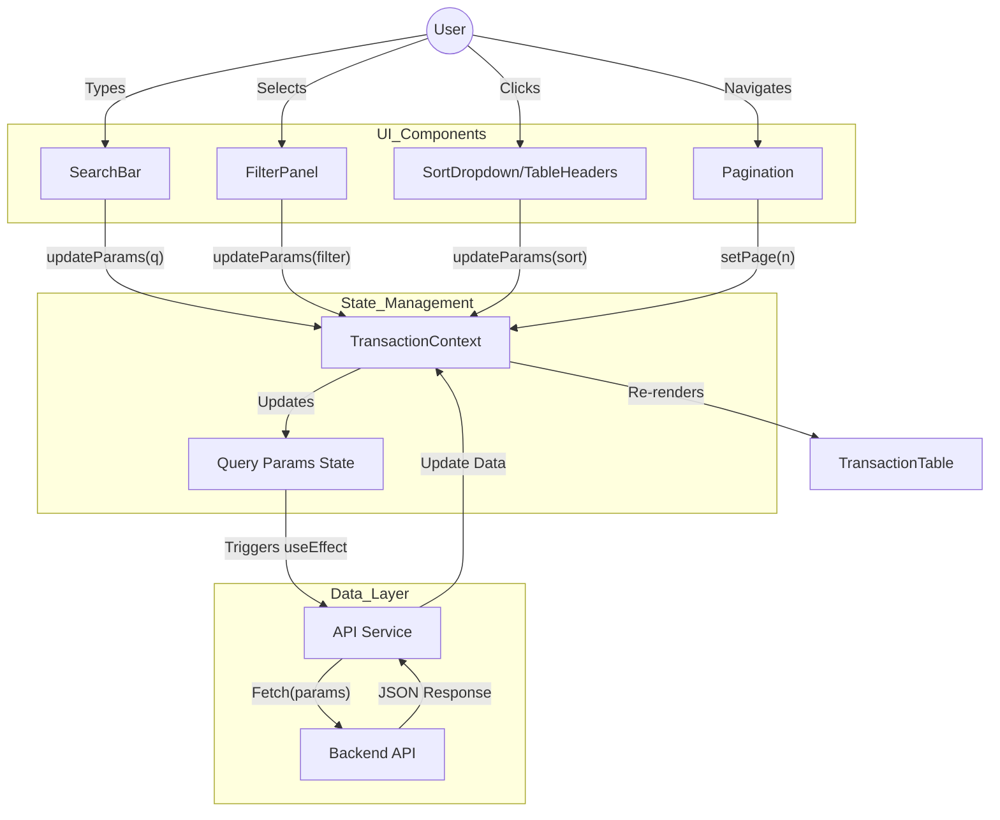

# Frontend Component Architecture

## Overview
The frontend is designed as a modular React application using a **Centralized Context-based State Management** strategy. This ensures that search, filters, sorting, and pagination work in unison without prop-drilling or state de-synchronization.

## Folder Structure
```
frontend/src/
├── components/
│   ├── SearchBar.jsx         # Debounced text input
│   ├── FilterPanel.jsx       # Multi-select and range inputs
│   ├── SortDropdown.jsx      # Mobile-friendly sorting control
│   ├── TransactionTable.jsx  # Data display with header sorting
│   └── Pagination.jsx        # Page navigation controls
├── context/
│   └── TransactionContext.jsx # Unified state (query params + results)
├── services/
│   └── api.js                # API fetch abstraction
├── App.jsx                   # Layout and component composition
└── main.jsx                  # Entry point
```

## State Management Strategy
We use a **Unified Query State** object within `TransactionContext`.
```javascript
{
  q: '',                // Search query
  region: '',           // Filter
  sortBy: 'date',       // Sort field
  sortOrder: 'desc',    // Sort direction
  page: 1,              // Current page
  limit: 10,            // Items per page
  // ...other filters
}
```
**Benefits**:
- **Single Source of Truth**: The `params` object defines the current view completely.
- **Automatic Reset**: Changing a filter automatically resets `page` to 1.
- **Debouncing**: Search input is debounced to prevent API spam.

## Interaction Flow



## Component Definitions

### 1. `TransactionContext`
- **Role**: Provider of state and actions.
- **Exports**: `transactions`, `loading`, `params`, `updateParams`, `setPage`.

### 2. `SearchBar`
- **Props**: None (uses Context).
- **Behavior**: Local state for input value, `useEffect` or timeout for debounced call to `updateParams`.

### 3. `FilterPanel`
- **Props**: None.
- **Behavior**: Renders selects/inputs based on `filterOptions` from API. Updates specific fields in `params`.

### 4. `SortDropdown` (Mobile / Auxiliary)
- **Design**: A dropdown useful for mobile views where table headers are not clickable.
- **Options**: "Date: Newest", "Date: Oldest", "Price: High to Low", etc.

### 5. `TransactionTable`
- **Behavior**: Iterates over `transactions`. Headers click trigger `updateParams({ sortBy: ... })`.
